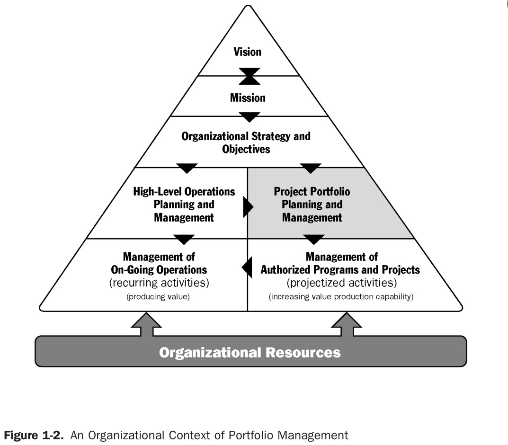
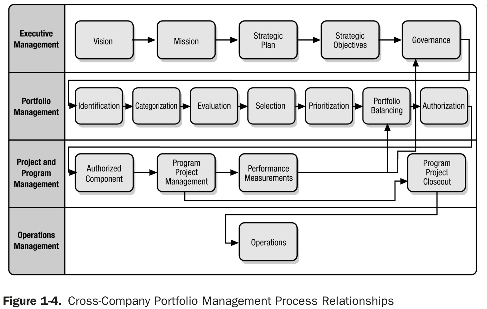
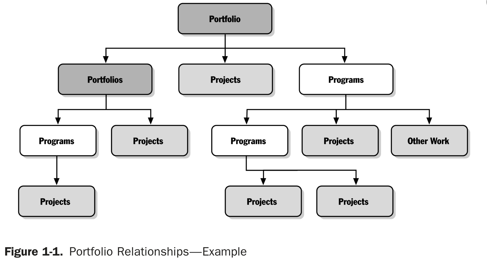

# Introducction

Project management consists of managing resources in the best possible way to chieve the company's objectives efficiently. 

## Glossary

### Definitions

-**Organization**: A group of people who work together in an organized way for a shared purpose. [Cambridge Dicctionary](https://dictionary.cambridge.org/dictionary/english/organization)

-**Vision**: Outlines what you want to become and how you want to impact society and its people. Future-focused. [Quick Sprout](https://www.quicksprout.com/vision-and-mission-statement)

-**Mision**: Primary goals, purposes, and values of an organization. Present-focused. [Quick Sprout](https://www.quicksprout.com/vision-and-mission-statement)

-**Resources**: Capital and workers.

-**Project**: A project is a temporary endeavor undertaken by a company or organization, i.e. creation of a new product or service. [Northeastern University](https://www.northeastern.edu/graduate/blog/project-management-vs-portfolio-management-vs-program-management)

-**Program**: A group of projects that are similar or related to one another, and which are often managed and coordinated as a group instead of independently. [Northeastern University](https://www.northeastern.edu/graduate/blog/project-management-vs-portfolio-management-vs-program-management)
    
-**Portfolio**: A group of different programs and/or projects within the same organization, which may be related or unrelated to one another. [Northeastern University](https://www.northeastern.edu/graduate/blog/project-management-vs-portfolio-management-vs-program-management)

-**Internal service**: A service for _organization_'s employees.

-**External service**: A service for _organization_'s clients. 

### Acronyms

-**NGO**: Non-Governmental Organization.
-**IT**: Information Technology.

## Orgatization

_Organizations_ are guided by theirs _vision_ and _mission_, so they must manage their _resources_ efficiently to fulfil them. This gap (the "manage") between _vision_ and _mission_ and _resources_ is where project management comes in. 

As the figure shows, an entire organizatinal strategy is planned. Then this strategy leads to the management of _portfolios_, _programs_ and _projects_. 

### Attitude towards change

The organizatinal strategy and project planning seems to be static---planned for a whole year, and then it is nerver touched again---but is not. The world is constantly changing and organizations that want to survive must do so as well.

### Project management methodologies

For project management it is necessary to define an appropriate methodology. There are some of them:

- [SCRUM](https://en.wikipedia.org/wiki/Scrum_(software_development)) (software development) 
- [PMBOK](https://en.wikipedia.org/wiki/Project_Management_Body_of_Knowledge)
- [KANBAN](https://en.wikipedia.org/wiki/Kanban) 

## _Portfolios_, _programs_ and _projects_

See [glossary](#definitions).

The idea is to group the _resources_ of related _projects_, so that _resources_ are better utilized and easier to organize. 

As the figure shows there is a hierarchy: _Portfolios_ > _Programs_ > _Project_. 

### Strategic considerations for initiating projects

There are many reasons for an organization to initiate projects. There are some examples:

- **Market Demand**: An automobile manufacturing company authorizes a project that will build more efficient cars.
- **Business needs/opportunities**: A training company creates a new course to increase revenue.
- **Organizational Needs**: Due to high costs, a company could combine its administrative staffing functions with the order taking processes to reduce costs.
- **Customer requests**: An electric utility authorizes a project to serve a new industrial park.
- **Technology Advances**: A company authorizing a new project to develop a faster and cheaper laptop.
- **Legal requirements**: A chemical company authorizes a project to establish guidelines for handling a new toxic material.
- **Ecological impact**: A company authorizes a project to reduce its environmental impact.
- **Social needs**: An _NGO_ authorizes a project in a developing country to provide drinking water systems and health education to prevent cholera.

## Software projects

Where is the software in project management? 

### _IT_ department

Organizations are usually organized in departments. Software is usually in the _IT_ department. 

The _IT_ department:

- Offers _internal_ and _external services_.
- Supports workflows.
- Is essential to the business.

