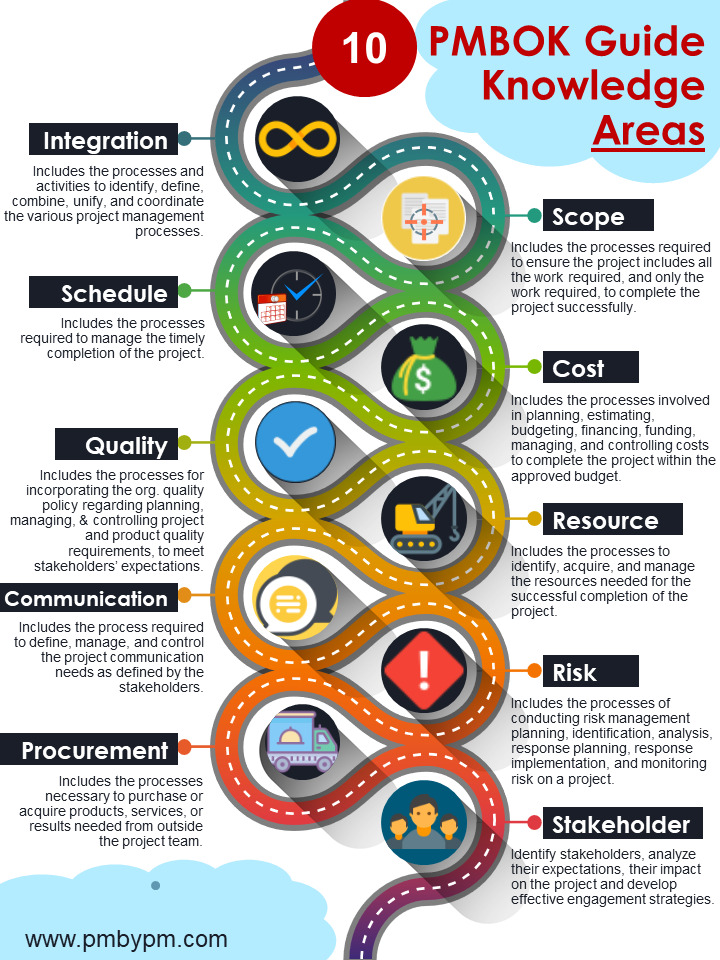
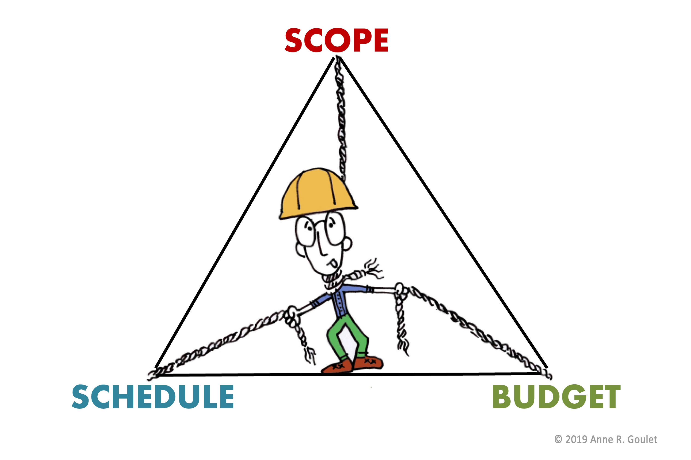

# Metodology 

Project management is a complex task, and to deal with that complexity we must follow a methodology.

But which methodology do we choose?

## Project management methodologies

The main project management metodologies, oriented to processes, and which also have certification are the following:

- [**PMBOK**](https://en.wikipedia.org/wiki/Project_Management_Body_of_Knowledge): The most widespread and prestigious. 
- [PRINCE 2](https://en.wikipedia.org/wiki/PRINCE2): Mainly in Europe.
- [ISO 21500](https://en.wikipedia.org/wiki/ISO_21500): High similarity with _PMBOK_.
- [_CMMI_](https://en.wikipedia.org/wiki/Capability_Maturity_Model_Integration): Broader scope than project management.
- [Métrica 3](https://administracionelectronica.gob.es/pae_Home/pae_Documentacion/pae_Metodolog/pae_Metrica_v3.html): For the planning, development and maintenance of information systems.

## Agile metodologies 

Agile methods are those that try to be very flexible and incorporate the customer in the development.

There are theirs characteristics: 

- User collaboration, business people and developers work together.
- Attitude to embrace change.
- Response to changes on top of follow-up of plans.
- Flexible project plan.
- Frequent system _deliveries_ (demos)
- Simplicity is essential.

The most widespread and prestigious is [Scrum](https://en.wikipedia.org/wiki/Scrum_(software_development)).

## PMBOK knowledge areas

## Project constraints

The projects are subject to many constraints, many of them contrary. So adding or modifying one of them implies having to modify others as well, and therefore implies a risk.

Any constraints fit in one or a combination of these constraints:

- **Scope**
- **Time**
- **Cost**

They are typically represented in as a triangle.

The project manager tries to meet the expectations of the customer, who is looking for the **broader scope**, the **shortest time** and the **lowest cost**. 

As they say: <q>To get all three is impossible, choose two.</q>

## Registration

Project management implies take records of many things:

- Risks.
- Improvement opportunities.
- Tasks and actions. 
- Problems, changes requests.
- Errors and improvements.
- Communication and meeting management.

In order to efficiently manage all these tasks, project management tools must be used. There are some of them:

- [Microsoft Project](https://www.microsoft.com/en-us/microsoft-365/project/project-management-software) / [Projectonline](https://project-online.com)
- [JIRA](https://www.atlassian.com/software/jira) (Atlassian)
- [Redmine](https://www.redmine.org) (**open-source**)
- [TFS](https://www.geeksforgeeks.org/what-is-team-foundation-server) (Team Foundation Server - Microsoft)
- [Trello](https://trello.com) (Atlassian)
- [Slack](https://slack.com)
- [Asana](https://asana.com)
- [GitLab](https://about.gitlab.com) (**open-source**)
- [GitHub](https://github.com)

