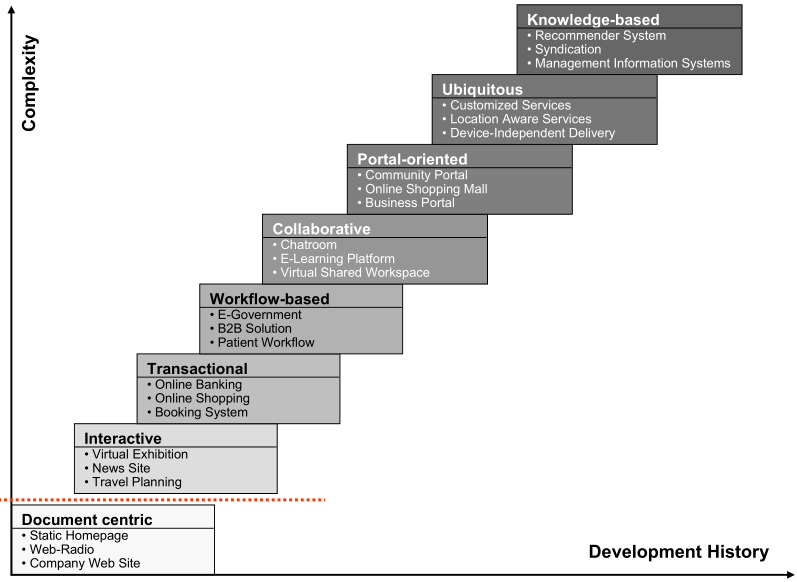

# Fundamentals 

## Glossary

- **Internet**: Computers net supported by TCP/IP protocol.
- **PC Era**: Before the _Web_. 

## Acronyms

- **AI**: Artificial Intelligence.
- **CSS**: Cascading Style Sheet.
- **DB**: Data Base.
- **DL**: Deep Learning.
- **DOM**: Document Object Model.
- **HTML**: HyperText Markup Language.
- **IoT**: Internet of Things.
- **OWL**: Web Ontology Language.
- **PC**: Personal Computer.
- **SPARQL**: Semantic Protocol And RDF Query Language.
- **Web**: [World Wide Web](#the-web). 
- **W3C**: [World Wide Web Consortium](#w3c).
- **XHTML**: Extensible HyperText Markup Language.
- **XML**: Extensible Markup Language.
- **XSLT** Extensible Stylesheet Language.

### Protocols 

- **IP**: Internet Protocol. (Internet layer)
- **TCP**: Transmission Control Protocol. (Transport layer)
- **HTTP**: Hypertext Transfer Protocol. (Application layer)

## The _Web_ 

The _Web_ is one service deployed over _Internet_.

- The main file in the _Web_ is the _HTML_.
- The _Web_ is supported by _HTTP_ over _TCP/IP_.
- The _Web_ is standardised by _W3C_ since 1994.

The _Web_ has evolved from _PC Era_ to Web 4.0.

### Web 1.0 

Started in 1991. 

People connecting to servers.

- Static webs.
- Few content producers / Many readers.
- Rreduced interaction.

#### Tecnologies: 

- _HTTP_ as application protocol. 
- _HTML_ as information document.

### Web 2.0 

Started in 2004. 

People connecting to people.

- Blogs and social networks began.
- Sharing contents.
- Communities.

#### Tecnologies

- _XHTML_ and _CSS_ to data presentation.
- _DOM_ for interactivity.
- _XML_ and _XSLT_ for information sharing.
- JavaScript and Ajax.

### Web 3.0

Started in 2010.

Semantic web. 

- Software capable of process, reason and logic deduction.  
- Well-labeled information. 

#### Tecnologies

- OWL-S for ontology.
- SPARQL for DB queries.

### Web 4.0

Started in 2020.

Distributed resources.

- Configurable services.
- Massively scalable services. 
- Cloud computing, portability, IoT, AI and DL.
- New interfaces (i.e. voice interfaces). 

## Web applications

This has been the evolution of web applications:

- **Document centric**: Static _HTML_.
- **Interactive**: Dynamic HTML generation.
- **Transactional**: _DB_ queries and transactions.
- **Workflow-based**: To manage workflows across departments, organisations and companies, etc.
- **Collaborative**: Shared projects and information.
- **Portal-oriented (Website)**: Offers a broad array of resources and services---usually related.
- **Ubiquitous**: Services to be accessed anywhere and anytime.
- **Knowledge based**: Personalized based on data. 
- **Cloud computing**: Computing and storage as a service.

