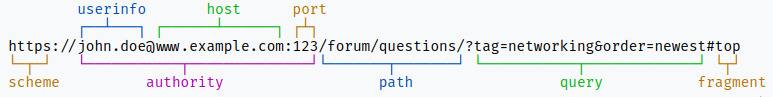

# REST

_REST_ (REpresentational State Transfer) is an **architectural style** for **_distributed systems_** based on **hypermedia** like _The Web_. _REST_ is based on **resources and representations**. 

## Concepts

### Resources 

_REST_ resources **have**:

- An **_URI_**
- **Hyperlinks** to them 
- A **state** 
- **Representation**: txt, html, json, xml, etc. 

### Representations 

- Resources are not their representations, i.e. Users stored in a _DB_ (the resource) can be represented in txt, html, json, xml, etc.
- A representation represents the resource state. 
- Many representations can be acceded with the same _URI_.

### _URI_

An _URI_ (Uniform Resource Identifier) unequivocally identify a resource.

#### Syntax

##### URI syntax 

**_URI_** = scheme ":" ["//" authority] path ["?" query] ["#" fragment]

where authority syntax is the following.

##### Authority syntax

**_authority_** = [userinfo "@"] host [":" port]

#### Example

There is an **example** from [wikipedia](https://en.wikipedia.org/wiki/Uniform_Resource_Identifier):

Indeed the wikipedia link is an _URI_ and also this website.

## Principles 

The _REST_ Principles are: 

- Stateless 
- Client-server 
- Uniform interface 
- Cacheable 
- Layered system 
- Code on demand 

Principles from [RapidApi](https://rapidapi.com/guides/rest-api-principles).

### Stateless 

An _HTTP_ request will contain all the necessary information to make the server understand the request.

That information is in the _URI_, their parameters, the _HTTP_ header and body. 

### Client-server 

Both the client and the server are completely autonomous in every way. Their communication will only happen using the _REST_ _API_. 

This improves the portability of the codebase across multiple platforms and also helps with making the server scalable.

### Uniform interface 

Provides four interfaces to achieve uniformity:

- Resource identification by _URI_
- Resource manipulation using representations
- Self-descriptive messages
- Hypermedia as the engine of application state

### Cacheable 

If a response is set as cacheable, both client and server can save a copy in chache.

This improve the performance:

- When the server does the cache, it reduces the server load and decrease the reponse time.
- When the client does the cache, is not needed to send the request. 

### Layered systems

Relies on layered system architecture. So the client can not know at any time whether it is connected to the final server or to an intermediate one.

This helps with improving security as components in each layer cannot interact beyond the next immediate layer they are in.

### Code on demand

It allows a client code to be downloaded and to be used within the application.

This is not a required constraint. 
