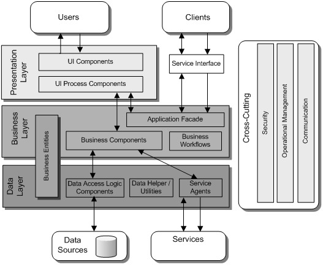
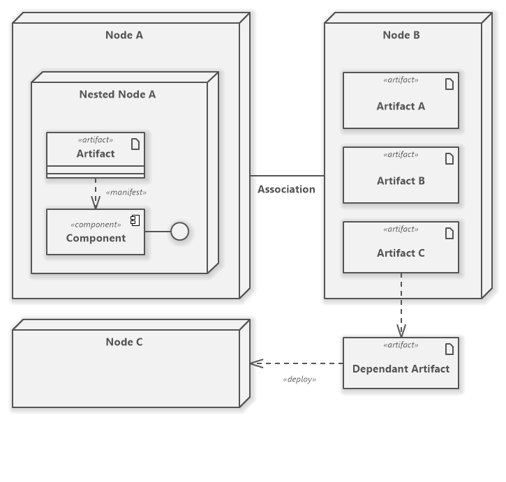
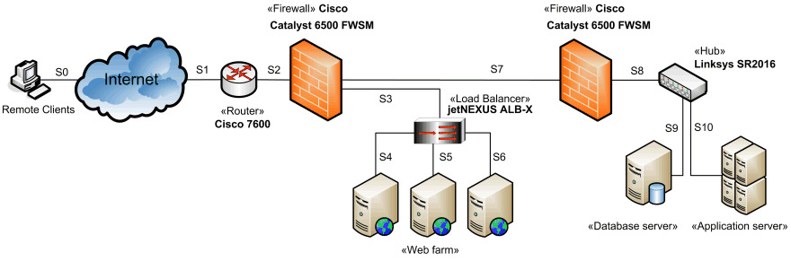

# Software architecture

## What is software architecture?

Software architecture refers to the **fundamental structures of a software system** and the discipline of creating such structures and systems. Each structure comprises software elements, relations among them, and properties of both elements and relations.

Software architecture is usually **represented as with a _model_**.

### Architecture _model_

Architecture _modeling_ have the following characteristics:

- It represents a set of **structures necessary to reason** about such a system.
- It is an **abstraction** that dispenses with details.

## Architectural points of view

Architecture can be defined from physical or logical point of view. 

### Physical architecture

Physical elements for software execution:

- Hardware
- Third party software
- Other elements external to the application

### Logical architecture

Software components. Group the different functionalities.

- It deals with the **public part** of the elements of the system.
- **Describes** the software **components**, the **relationships** between them and their **properties**
- **Ignores** the internal **implementation** of the components

### Mixed architecture 

It is also usual to represents both together: physical as tiers, logical as layers.

## Architecture layers 

Each architecture layer, has a specific purpose. 

### Presentation layer

- Displays the user interface
- Facilitates user interaction with the system
- Server-side contains a component that generates and serves the _HTML_.
- Client-side contains a browser that displays _HTML_ and executes scripts.
- Computational load:
    - Traditionally the presentation logic was server-side.
    - Technologies such as _AJAX_ allow logic to be executed on the client-side.

### Business layer

- Includes business logic
- Allows reuse of business logic functions
- Enables improved maintenance and testing

### Data layer

Abstracts the logic needed to access the _DB_.

### Service layer

- Encapsulates access to external services residing on a remote machine
- The system itself can be offered as web services.

## Architecture scalability

Scalability is how increased data usage and data growth affects _performance_.

It is important: 

- The correct dimensioning of the application
- The adaptability of the system to increased demand.

There are two ways of scaling a system: vertical or horizontal scaling.  

### Vertical scaling

Adding more power to the machine hosting the system

- Faster _CPU_
- More _RAM_
- _SSD_ disks

### Horizontal scaling

Creating system clones and load balancing. Balancing can be done by hardware or software. 

#### Hardware balancing
    
Different requests from the same user can be handled by different clones.

Based on routing, tunneling or IP translation.

#### Software balancing
    
All requests from a user are served by the same clone.

Done by inspecting _HTTP_ packets to maintain the user session in the same machine. 

## Architecture patterns

They describe a general solution to a design problem that is frequently encountered.

- Are general organization schemes of a system
- Specify a series of subsystems or components and their responsibilities 
- Define rules for organizing the interactions between them

More about architecture patterns [here](https://towardsdatascience.com/10-common-software-architectural-patterns-in-a-nutshell-a0b47a1e9013).

## Architectural modeling in UML

### Components diagram

A component diagram is composed of software components.

A software component is a composition unit with all its interfaces and context dependencies explicitly defined.

#### Components properties 

- **Ports**: Connection points between your internal structure and your environment.
- **Interfaces**: Services offered and required to compose it with others.
- **Realizations**: The classes that implement it.
- **Artifacts**: The physical files that enable its deployment.
    - Source files
    - Scripts
    - Executables

### Deployment diagram

Shows the communication topology of a distributed system.

- They represent the nodes or devices of the system
- The connections between the nodes
- The assignment of artifacts and software components to each node

It is the highest level diagram in _UML_.

The use of visual stereotypes allows a particularized representation of the deployment diagram.

