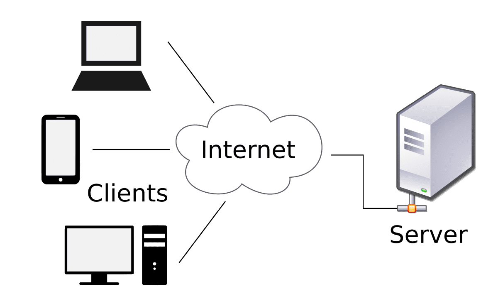

# Web services

## What are web services?

A web service is a software **function** that is **hosted at a network addressable location**. [IBM](https://www.ibm.com/docs/en/cics-ts/5.2?topic=services-what-is-web-service)

_Distributed systems_ rely on web services.

### What they solve?

Web services attempt to **solve** some of the **problems** presented **by other distributed systems development technologies**:

- **Complexity**: High learning curve. 
    - **Solution**: Web services are **easy** to learn. 
- **Interoperability**: Different implementation languages. 
    - **Solution**: Web services are **platform-independent**.  
- **Firewall**: Need to configure the non-standard ports to be used.
    - **Solution**: Web services use only **standard ports**, because they use _HTTP_ (port 80) or _HTTPS_ (port 443) protocol, which are standard ports. 

### Architecture

Web services follows Client-Server pattern. 

### Views

#### Conceptual

- **Software** component accesible **through network**. 
- Both clients and services **send** requests and responses---respectively---**via messages**.
- They make **no assumptions about the technological characteristics** of the receiver.

#### Technological

They are two main approaches:

- **_SOAP_ service**: Offers an **arbitrary** set of operations. (Complex)
- **_REST_ service**: Manipulate representations of web resources using a **uniform** set of **stateless** operations. (Simple)

## _SOAP_ vs. _REST_

### _SOAP_

_SOAP_ is a protocol for **information exchange** in a **decentralized and distributed environment**. 

Defines a **message** architecture and its **formats** in **_XML_**. The language is _WSDL_. 

#### _WSDL_  

- **_XML_ format for interface operations**, parameters, messages and response type.
- **Contract** between the server and the client: **what should** the request and response **messages contain**. 
- Declare **where** the service is.
- What **protocol** will be used. 

_WSDL_ examples [here](https://www.w3schools.com/XML/xml_wsdl.asp). 

### _REST_ 

_REST_ services are **viewed as resources** and may be **invoked with an _URI_**. 

Consider **_HTTP_** not only as a transport protocol, but also **as an _API_**.

#### Resource 

_REST_ resources **have**:

- An **_URI_**
- **Hyperlinks** to them 
- A **state** 
- **Representation**: txt, html, json, xml, etc. 

Resources are not their representations, i.e. Users stored in a _DB_ (the resource) can be represented in txt, html, json, xml, etc.
